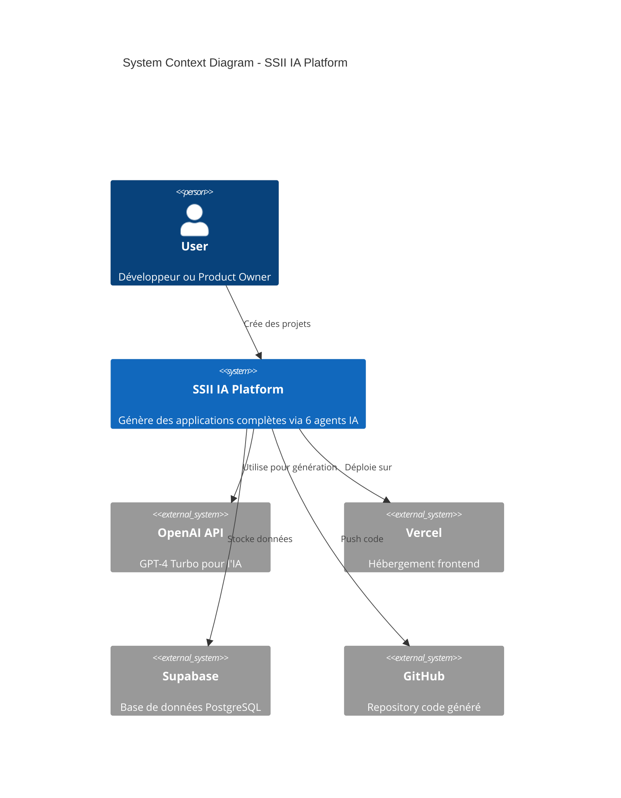
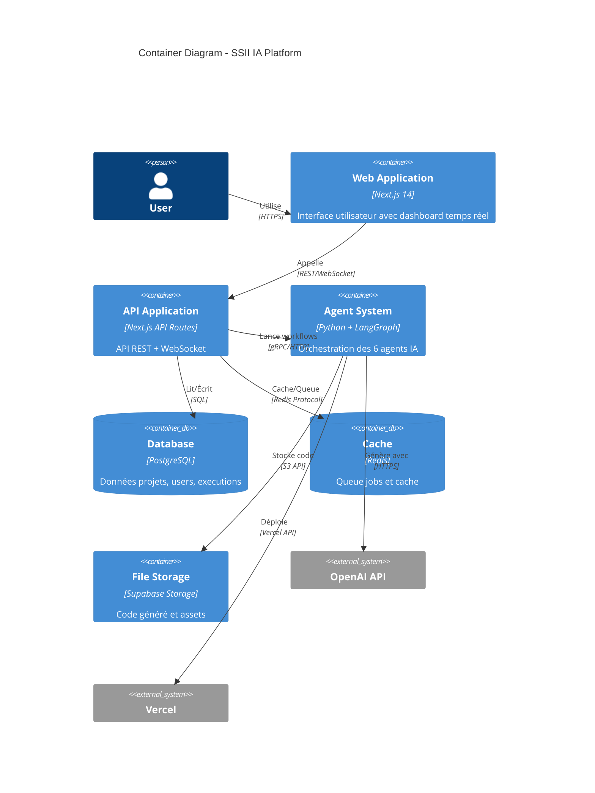
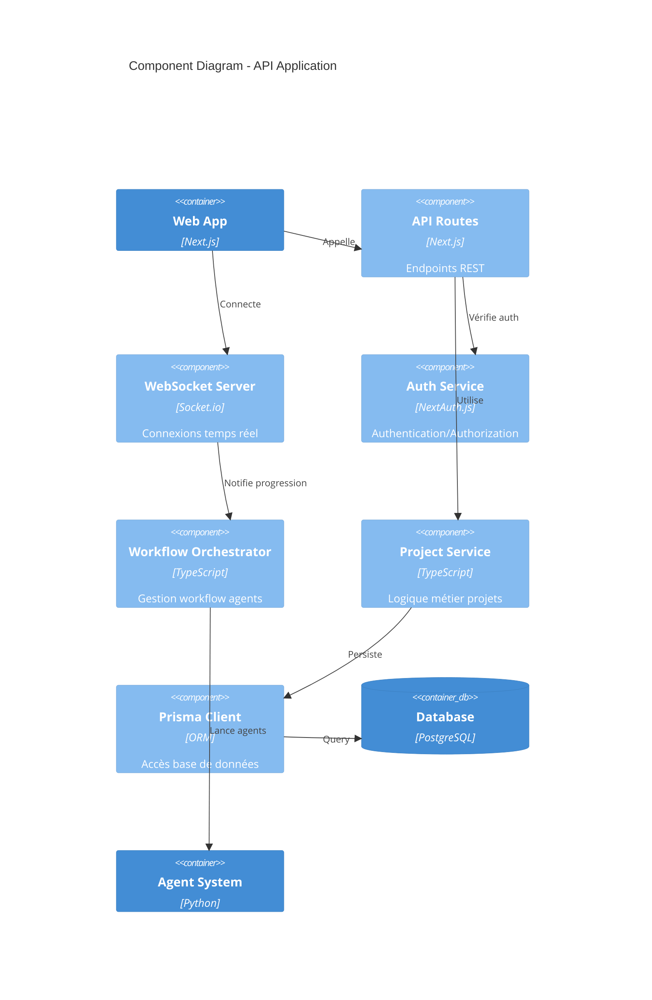
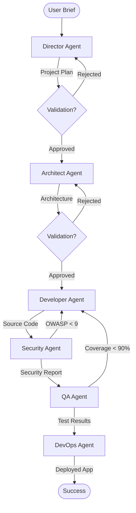
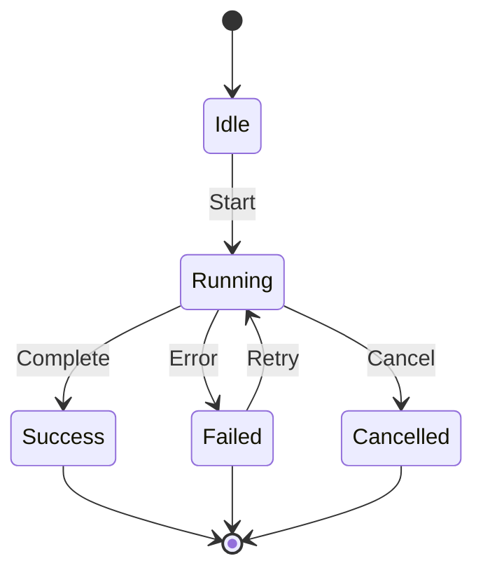
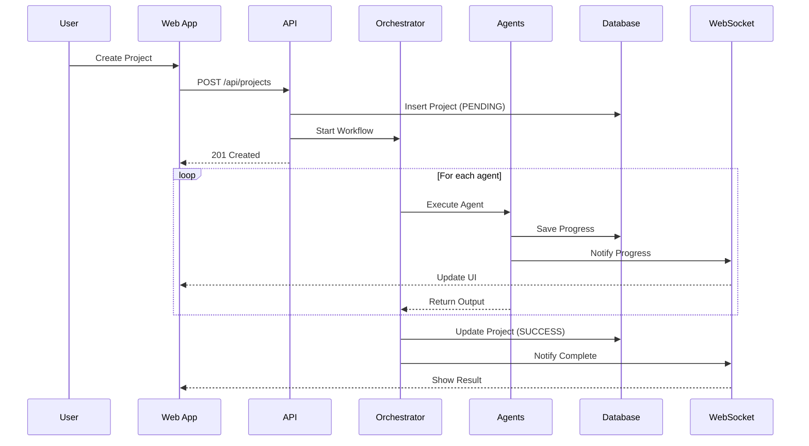
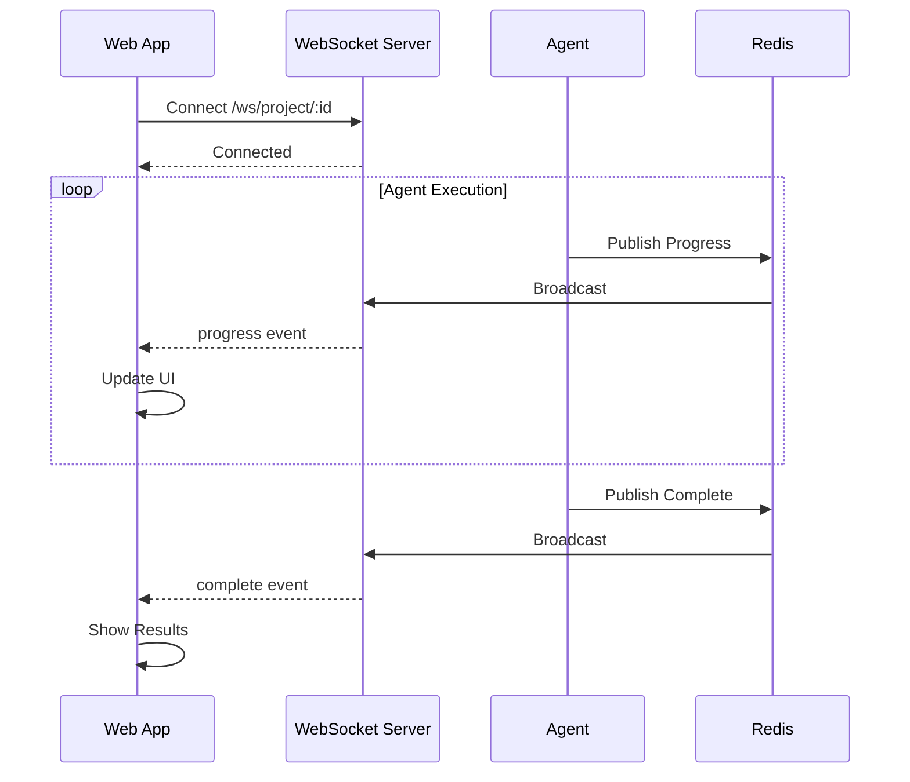
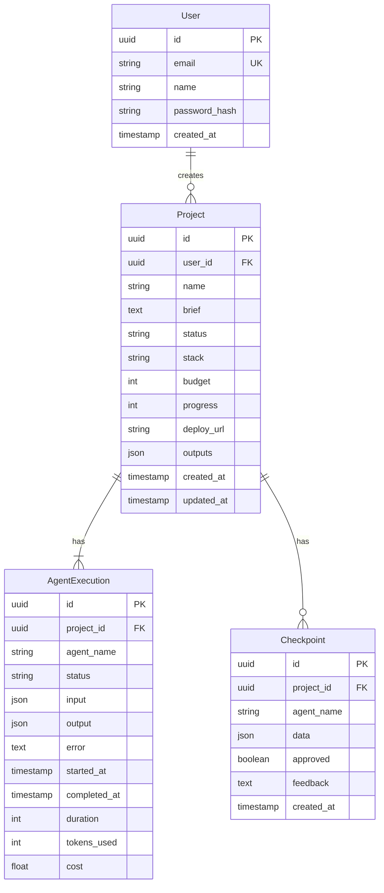
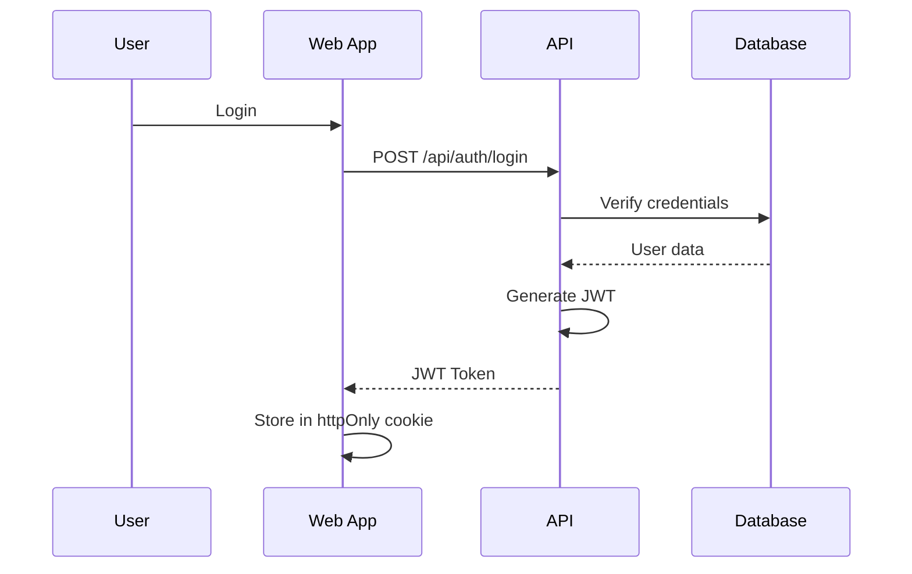
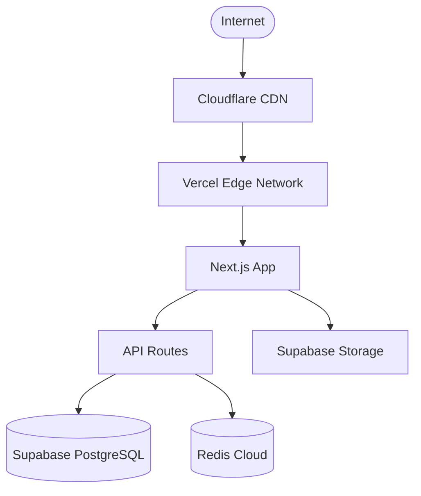

# Architecture Documentation

## Table of Contents

- [Overview](#overview)
- [System Architecture](#system-architecture)
- [Agent Architecture](#agent-architecture)
- [Data Flow](#data-flow)
- [Database Schema](#database-schema)
- [API Architecture](#api-architecture)
- [Security Architecture](#security-architecture)
- [Deployment Architecture](#deployment-architecture)
- [Scalability](#scalability)
- [ADRs](#architectural-decision-records)

## Overview

SSII IA Platform est une plateforme de génération automatique d'applications basée sur 6 agents IA spécialisés orchestrés par LangGraph.

### Key Principles

1. **Agent-Based Architecture**: Chaque agent est responsable d'une phase spécifique
2. **Stateful Workflow**: L'état est persisté à chaque étape
3. **Validation Checkpoints**: Points de validation humaine optionnels
4. **Cost Optimization**: Infrastructure optimisée pour < 50€/mois
5. **Quality First**: Tests > 90%, OWASP > 9/10, Lighthouse > 95

## System Architecture

### C4 Model - Context Diagram



### C4 Model - Container Diagram



### C4 Model - Component Diagram (API)



## Agent Architecture

### Agent Workflow



### Agent State Machine



### Agent Communication

Chaque agent:
1. Reçoit l'output de l'agent précédent
2. Effectue son traitement via OpenAI GPT-4
3. Valide son output avec Zod schemas
4. Sauvegarde dans la base de données
5. Notifie via WebSocket
6. Passe au prochain agent

### Agent Specifications

#### 1. Director Agent

**Responsabilité**: Analyse du brief et planification projet

**Input**:
```typescript
interface DirectorInput {
  brief: string;
  userId: string;
  options?: {
    budget?: number;
    timeline?: number;
  };
}
```

**Output**:
```typescript
interface DirectorOutput {
  title: string;
  objectives: string[];
  userStories: UserStory[];
  timeline: number; // weeks
  budget: number; // EUR
}
```

**Constraints**:
- Budget ≤ 50€
- Chaque user story ≤ 4h
- Priorités: Must, Should, Could, Won't (MoSCoW)

#### 2. Architect Agent

**Responsabilité**: Conception architecture technique

**Input**: `DirectorOutput`

**Output**:
```typescript
interface ArchitectOutput {
  stack: 'NEXTJS' | 'REACT_NATIVE' | 'FLUTTER';
  frontend: FrontendConfig;
  backend: BackendConfig;
  database: DatabaseSchema;
  infrastructure: InfraConfig;
  architecture: ArchitecturePattern;
}
```

**Decisions**:
- Stack basé sur user stories
- Database schema from requirements
- Infrastructure cost-optimized

#### 3. Developer Agent

**Responsabilité**: Génération code source complet

**Input**: `ArchitectOutput + UserStory[]`

**Output**:
```typescript
interface DeveloperOutput {
  files: CodeFile[];
  structure: ProjectStructure;
  dependencies: Package[];
}
```

**Best Practices**:
- TypeScript strict mode
- Components modulaires
- Code commenté
- Tests inclus

#### 4. Security Agent

**Responsabilité**: Audit sécurité OWASP

**Input**: `DeveloperOutput`

**Output**:
```typescript
interface SecurityOutput {
  owaspScore: number; // /10
  vulnerabilities: Vulnerability[];
  checklist: OWASPChecklist;
  recommendations: string[];
}
```

**Validations**:
- OWASP Top 10 2021
- Score minimum: 9.0/10
- Auto-fix si possible

#### 5. QA Agent

**Responsabilité**: Tests et qualité

**Input**: `DeveloperOutput`

**Output**:
```typescript
interface QAOutput {
  testResults: TestResults;
  lighthouseScores: LighthouseScores;
  codeQuality: CodeQualityMetrics;
  recommendations: string[];
}
```

**Metrics**:
- Coverage > 90%
- Lighthouse Performance > 95
- ESLint errors = 0

#### 6. DevOps Agent

**Responsabilité**: Déploiement et infrastructure

**Input**: `DeveloperOutput + ArchitectOutput`

**Output**:
```typescript
interface DevOpsOutput {
  deploymentUrl: string;
  databaseUrl: string;
  status: 'deployed';
  infrastructure: InfraDetails;
  costs: CostBreakdown;
  healthChecks: HealthStatus;
}
```

**Platforms**:
- Frontend: Vercel
- Database: Supabase
- Backend: Railway (si nécessaire)

## Data Flow

### Project Creation Flow



### Real-time Updates Flow



## Database Schema



### Prisma Schema

```prisma
model User {
  id        String    @id @default(uuid())
  email     String    @unique
  name      String
  password  String
  projects  Project[]
  createdAt DateTime  @default(now())
  updatedAt DateTime  @updatedAt
}

model Project {
  id               String            @id @default(uuid())
  userId           String
  user             User              @relation(fields: [userId], references: [id])
  name             String
  brief            String
  status           ProjectStatus     @default(PENDING)
  stack            String?
  budget           Int?
  progress         Int               @default(0)
  deployUrl        String?
  outputs          Json?
  agentExecutions  AgentExecution[]
  checkpoints      Checkpoint[]
  createdAt        DateTime          @default(now())
  updatedAt        DateTime          @updatedAt

  @@index([userId, status])
}

model AgentExecution {
  id          String    @id @default(uuid())
  projectId   String
  project     Project   @relation(fields: [projectId], references: [id], onDelete: Cascade)
  agentName   String
  status      String
  input       Json?
  output      Json?
  error       String?
  startedAt   DateTime
  completedAt DateTime?
  duration    Int       @default(0)
  tokensUsed  Int       @default(0)
  cost        Float     @default(0)

  @@index([projectId, agentName])
}

model Checkpoint {
  id        String   @id @default(uuid())
  projectId String
  project   Project  @relation(fields: [projectId], references: [id], onDelete: Cascade)
  agentName String
  data      Json
  approved  Boolean?
  feedback  String?
  createdAt DateTime @default(now())

  @@index([projectId])
}

enum ProjectStatus {
  PENDING
  RUNNING
  WAITING_CHECKPOINT
  SUCCESS
  FAILED
  CANCELLED
}
```

## API Architecture

### REST Endpoints

| Method | Endpoint | Description |
|--------|----------|-------------|
| POST | `/api/auth/signup` | Create account |
| POST | `/api/auth/login` | Login |
| GET | `/api/projects` | List user projects |
| POST | `/api/projects` | Create project |
| GET | `/api/projects/:id` | Get project details |
| PATCH | `/api/projects/:id` | Update project |
| DELETE | `/api/projects/:id` | Delete project |
| POST | `/api/projects/:id/cancel` | Cancel workflow |
| POST | `/api/checkpoints/:id/approve` | Approve checkpoint |
| GET | `/api/agents/:name/status` | Get agent status |

### WebSocket Events

**Client → Server**:
- `join:project` - Join project room
- `leave:project` - Leave project room

**Server → Client**:
- `agent:start` - Agent started
- `agent:progress` - Progress update
- `agent:complete` - Agent completed
- `agent:error` - Agent failed
- `checkpoint:required` - Validation needed
- `workflow:complete` - Project complete

## Security Architecture

### Authentication Flow



### Authorization

- **JWT Tokens**: Signed with HS256
- **Session Duration**: 7 days
- **Refresh Tokens**: Implemented
- **RBAC**: User/Admin roles

### Security Measures

1. **Input Validation**: Zod schemas
2. **SQL Injection**: Prisma ORM
3. **XSS Protection**: Content Security Policy
4. **CSRF**: Token-based protection
5. **Rate Limiting**: 100 req/min per IP
6. **Secrets**: Environment variables only
7. **HTTPS**: Forced in production

## Deployment Architecture

### Production Environment



### Infrastructure as Code

**Vercel** (vercel.json):
```json
{
  "buildCommand": "pnpm build",
  "devCommand": "pnpm dev",
  "installCommand": "pnpm install",
  "framework": "nextjs",
  "regions": ["iad1"],
  "env": {
    "DATABASE_URL": "@database-url",
    "OPENAI_API_KEY": "@openai-key"
  }
}
```

### Cost Breakdown

| Service | Plan | Cost/Month |
|---------|------|-----------|
| Vercel | Hobby | €0 |
| Supabase | Free | €0 |
| Redis Cloud | Free 30MB | €0 |
| OpenAI API | Pay-as-go | ~€20-40 |
| **TOTAL** | | **< €50** |

## Scalability

### Horizontal Scaling

- **Frontend**: Vercel Edge automatically scales
- **API**: Serverless functions auto-scale
- **Database**: Supabase connection pooling
- **Cache**: Redis cluster (when needed)

### Performance Optimizations

1. **Edge Caching**: Vercel Edge Network
2. **Image Optimization**: Next.js Image component
3. **Code Splitting**: Automatic route-based
4. **API Response Caching**: Redis
5. **Database Indexing**: Strategic indexes
6. **Lazy Loading**: Components and routes

### Monitoring

- **APM**: Vercel Analytics
- **Errors**: Sentry
- **Logs**: Vercel Logs + Supabase Logs
- **Uptime**: UptimeRobot

## Architectural Decision Records

### ADR-001: Next.js over separate frontend/backend

**Status**: Accepted

**Context**: Need full-stack framework

**Decision**: Use Next.js 14 with App Router

**Consequences**:
- ✅ Simplified deployment
- ✅ API routes co-located
- ✅ Better DX
- ❌ Vendor lock-in to Vercel

### ADR-002: PostgreSQL over MongoDB

**Status**: Accepted

**Context**: Need relational data with transactions

**Decision**: PostgreSQL via Supabase

**Consequences**:
- ✅ ACID transactions
- ✅ Strong typing with Prisma
- ✅ Better for complex queries
- ❌ Less flexible schema

### ADR-003: LangGraph over Custom Orchestration

**Status**: Accepted

**Context**: Need robust agent workflow

**Decision**: Use LangGraph for orchestration

**Consequences**:
- ✅ Battle-tested framework
- ✅ Built-in state management
- ✅ Checkpoint support
- ❌ Python dependency

### ADR-004: Monorepo over Multi-repo

**Status**: Accepted

**Context**: Frontend and backend in same codebase

**Decision**: Monorepo with pnpm workspaces

**Consequences**:
- ✅ Shared types
- ✅ Easier refactoring
- ✅ Single CI/CD
- ❌ Larger repository

---

**Last Updated**: 2025-01-10
**Version**: 1.0.0
**Maintainers**: SSII IA Team
